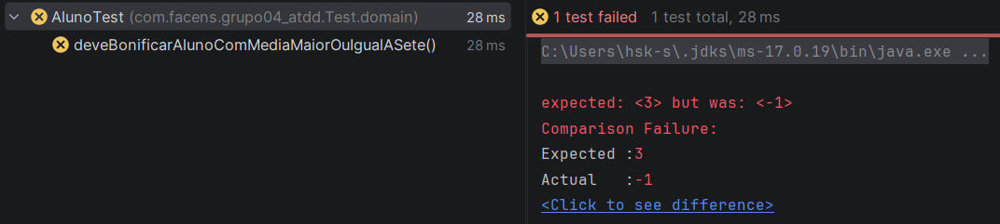
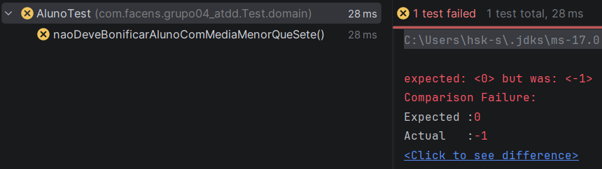
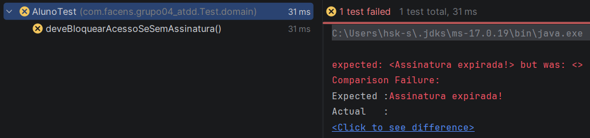
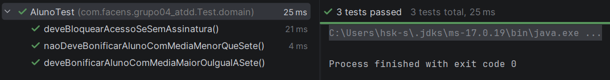
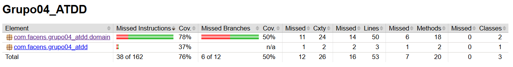
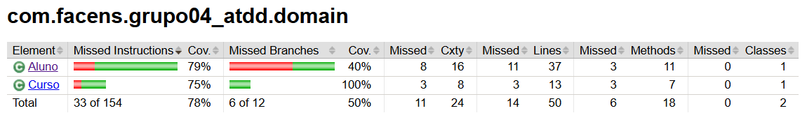
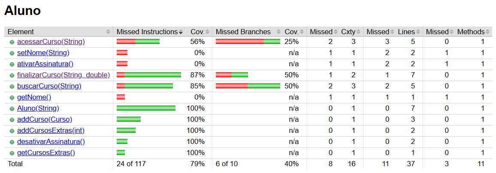
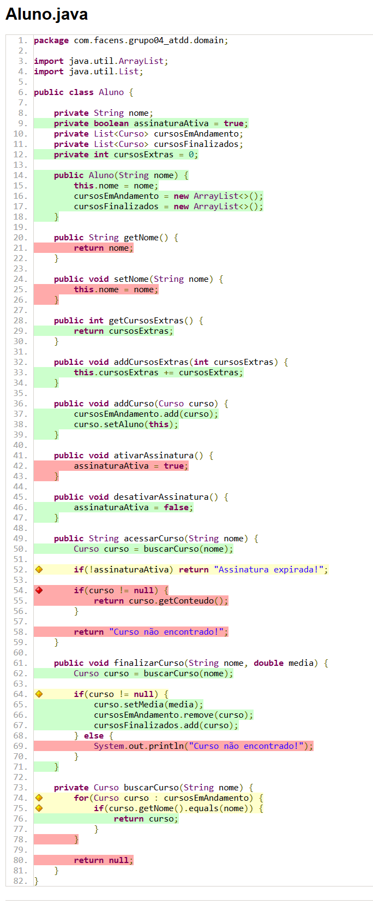

# ATIVIDADE AC1

## Detalhes do Projeto

### GAMIFICAÇÃO PARA ENGAJAMENTO DE EDUCAÇÃO CONTINUADA

Uma determinada plataforma vende cursos online e EAD no modelo de assinaturas. O aluno paga um valor mensal e tem acesso a um conjunto de cursos para assinatura básica. A cada curso terminado e com média acima de 7,0, o aluno tem direito a realização de mais 3 cursos. O aluno que escrever mais tópicos no fórum e ajudar outros participantes com seus comentários, ganha um curso no final do mês. Quando o aluno conquistar 12 cursos, seu plano de assinatura passa a ser “Premium” e ele passa a receber voucher para participar de projetos reais, durante os cursos, e receber 3 moedas, que podem ser convertidas em conhecimento (novos cursos), acumular ou receber por criptomoeda.

## User Stories

| #P | #C                  | As a < type of user >                          | I want < some goal >                                        | So that < some reason >                                       | 
|----|---------------------|------------------------------------------------|-------------------------------------------------------------|---------------------------------------------------------------|
| 1  | User (Luiz)     | COMO aluno de uma plataforma de cursos online  | QUERO ser recompensado ao completar certa quantia de cursos | PARA ganhar moedas e trocar por benefícios                    |
| 2  | User (Giulia)   | COMO aluno de uma plataforma de cursos online  | QUERO passar com média maior ou igual a sete                | PARA ganhar acesso a mais três cursos                         |
| 3  | User (Henrique) | COMO aluno de uma plataforma de cursos online  | QUERO realizar o pagamento de um valor mensal               | PARA ter acesso a um conjunto de cursos da assinatura básica  |

*A User Story 2 foi escolhida para ser implementada.

## BDD - SCENARIOS - ACCEPTANCE CRITERIA

| Given                                                         | And                                            | When                                                               | And                                                | Then                                                    | And | 
|---------------------------------------------------------------|------------------------------------------------|--------------------------------------------------------------------|----------------------------------------------------|---------------------------------------------------------|-----|
| Dada uma média maior ou igual a sete (Giulia)             | E o aluno estiver com a assinatura ativa       | Quando um curso for finalizado                                     | E a média final é estabelecida                     | Então o aluno deve receber o acesso a mais 3 cursos     |     |
| Dada uma média menor do que sete (Henrique)               | E o aluno estiver com a assinatura ativa       | Quando um curso for finalizado                                     | E a média final é estabelecida                     | Então não deve ser bonificado                           |     |
| Dado um usuário com cursos adicionados na conta (Luiz) | E a assinatura do usuário não estiver ativa                        | Quando tentar acessar qualquer um de seus cursos anteriormente disponibilizados |                  --                  | Então não terá acesso a esses cursos      |    |
| Dado a finalização de um curso (Luiz)                     | E a média do aluno ser igual ou superior a 7,0 | Quando um novo curso ser adicionado ao carrinho de compras         | E o usuário ter moedas de cursos bônus disponíveis | Então deve ser feita a transação sem cobrança adicional |     |

## TDD

| Scenario                                                                                                                                                                             | Execution                                                                      | Results (Asserts)                                  |
|--------------------------------------------------------------------------------------------------------------------------------------------------------------------------------------|--------------------------------------------------------------------------------|----------------------------------------------------|
| @Test public void deveBonificarAlunoComMediaMaiorOuIgualASete() { var aluno = new Aluno("Giulia", true); var curso = new Curso("Engenharia de Software");                | curso.finalizar(aluno, 7.0);                                                   | assertEquals(3, aluno.getCursosExtras()); }    |
| @Test public void naoDeveBonificarAlunoComMediaMenorQueSete() { var henrique = new Aluno("Henrique"); var matematica = new Curso("Matematica");                          | henrique.addCurso(matematica); henrique.finalizarCurso("Matematica", 6.8); | assertEquals(0, henrique.getCursosExtras()); } |
| @Test public void deveBloquearAcessoSeSemAssinatura() { var user = new user("Luiz"); var assinatura = new assinatura("assinatura"); assinatura.status = false; } | user.possuiCurso();| assertEquals(0, aluno.acessarCurso()){}; |
|                                                                                                                                                                                      |                                                                                |                                                    |
* Esse código precisou ser adaptado ao ser implementado no código.

## RED

### SCENARIO 1

### SCENARIO 2

### SCENARIO 3

## GREEN

### TESTS JUNIT

### JACOCO E COBERTURA DE TESTES

